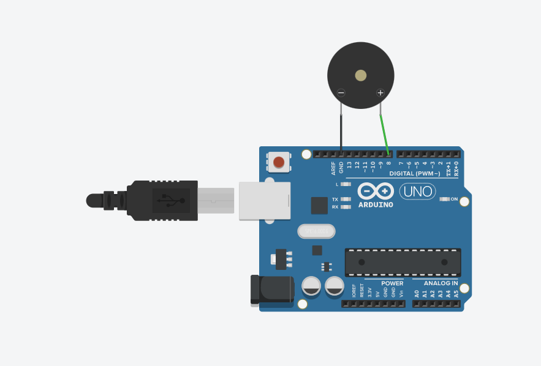

# Arduino PIANO

This repo hosts Arduino Code for Playing few songs on a Speaker (I have used a speaker) or Buzzer (eg. Pizo) connected Arduino. 

## Components Used

- Arduino UNO/Mega
- Buzzer

## Circuit Diagram

Buzzer or Speaker has 2 pins. One is connected to **GND** and another is connected to **PIN 8** of UNO or some other compatible board.

## Songs Played
The following 4 songs are played via the code. 

- **Game of Thrones**
- **Happy Birthday**
- **Coffin Dance**
- **Despacito**

To simplify the code, notes patterns and respective functions are stored in **Songs.h** file.

